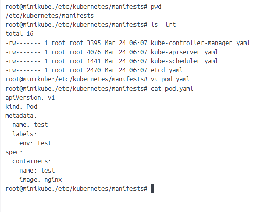
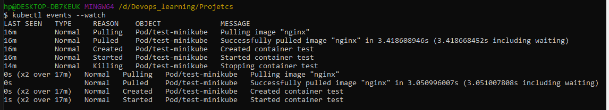

# Static Pod 

Static Pods are managed by Kubelet without API observation, other pods are managed by the control plan
Static pods are bound to one kubelet on a specific node 
For creating the static pods manifests we need to store that in specific path that is called staticpodpath in kubelet's configuation file 

### path for kubelet config file 

cd /var/lib/kubelet/
cat /var/lib/kubelet/config.yaml

### in this config file we can file the path for static pod file 

staticPodPath: /etc/kubernetes/manifests

if we make change in static manifest file it will affect the pod which are running 

we can't change the static pod using kubectl, we have modify the static pod file

### Eg for Staitc pod files 

 monitoring the events on kubectl 

 

  if we try to remove the static pod using kubectl 

  kubectl delete pod test-minikube

  kubelet will make it up again 

for removing the static pod we need to remove the static pod file 
