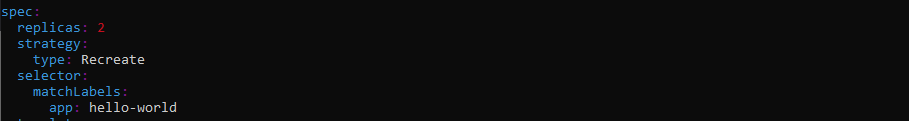
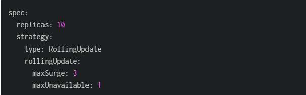

Controller Mananger 

kube-controller-Manger is responsible for to running core controller, keeping the central plane in desired state 

there is reprate controlle plan for cloud called as cloud-controller-manager 

controllers
 - Pods Controller 
   1. ReplicaSet
   2. Deployment 
   3. DeamonSet
   4. StatefulSet
   5. Job
   6. CronJob

- other controller
  1. Node
  2. Service
  3. Endpoint

how POD file is different from deployment file 
one pod file is deployed, after that controll plan will not monitor on that pod, if is failed or not 
where as for Deployment there is a controller which making shower, all pod are up as per given replicas in deployment file, if pod is failed due to some issue controller will start the other pod to match the replica given in deployment file 
  
we will work with deployment controller, we are going the deploy simple hello world yaml file, after that we will update the container image to new version and apply the deployment.

 1. we will deploy hello-world.yaml file first, using below command
    kubectl apply -f hello-world.yaml
    we can check the status of deployment 
    kubectl get pods 
 2. now we will update the the app image to 2.0 
    image = gcr.io/google-samples/hello-app:2.0 in same file 
    kubectl apply -f hello-world 
    to check the status of new rollout, we can use this command 
    kubectl rollout status deployment hello-world

   below is the out image for rollout command

   
    
    Both replicasets remain, that will become very useful when we need to rollback. replicaset for app version 1 and 2 
    kubectl get replicaset 

### Deployment strategies 
   - Recreating 
   - Rolling 
   - Blue/Green
   - Canary 

   Kubernetes by deafult uses Rolling deployment strategy

   - Recreating Deployment 
     Recreating deployment will terminate all the pod and replace them with new version. It can be usefull when old and new apps cannot run at same time 

     

   - Rolling Deployment 
     Rolling deployment is default strategy for kubernetes.
     rolling deployment will triggered when something changed in pod spec, such as pod image, labels or environment are updated in pod 
     we can update the image of the pod using below command 
     kubectl set image 

     The spec: -> strategy: section of the manifest file can be used to refine the deployment by making use of two optional parameters — maxSurge and maxUnavailable. Both can be specified using a percentage or absolute number. A percentage figure should be used when Horizontal Pod Autoscaling is used.

      - MaxSurge specifies the maximum number of pods the Deployment is allowed to create at one time.
      - MaxUnavailable specifies the maximum number of pods that are allowed to be unavailable during the rollout.  
        
        